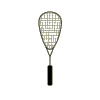
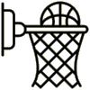

## Welcome to my homepage. You can find information about my projects, programming and hobbies.

I'm a class XI student at Bangalore International School.

# Projects

 - Online courses - Harvard CS50x.
 - Drone
 - Python Leetcode: www.leetcode.com/amogh5220
 - Pygame

# Sports I have play
## squash

I started playing squash a few months after covid hit. I go to Brigade Club at Malleswaram and usually play with my dad and his friends. I was the youngest in the group. He has been a long-time player and nudged me to try it. Once I gave it a shot I started liking it. Just before the second wave of lockdown, I used to play almost every other day. I wish there was a squash court at school so that I could play it along with basketball. I'm still an amateur and don't really follow professional games. Compared to tennis, I find squash to be more fun because of the smaller court. The first to get to 11 points wins the game. Unlike table tennis, the player who wins the point gets to serve. I haven't tried playing doubles.

## basketball 

i started playing basketball from around 6th grade, i haven't gone for any classes I have just played it for fun in school during the breaks. I dont follow proffesional games of basketball. I got into basketball because thats what my friends in school strated to play.
## swimming 

I have been doing swimming since around the 1st grade and have gone for classes and have done many events and won many medals for swimming. I have done a 1km race in a lake and finished it in about 30 minutes. I got into swimming competitions because I was good at it and i liked winning all the medals 
## football 

I started playing football sometime during school and went for a lot of classes for it. I have gone for a few tournaments from school and a few outside of school. I stopped playing football because it got boring for me and i had just got into basketball. 

# Other activities
 - Fund raising on GoSports.com. Collected over Rs. 1.5L to help paraolympic atheletes. 
 - Taught adults to use payment applications like PayTM. [tribesforgood.com]
 - Made over 500 paper bags for Zav.com. I had one month to make the paper bags. Dec - 2020.
 - 
 
# Treks
 - Get pictures
 

