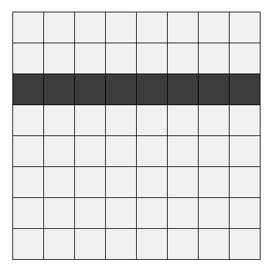

# Welcome to Amogh's homepage 


## this is the place where i shall present all my programming projects and writings.


i enjoy watching movies 

# cars
A  **car**  (or  **automobile**) is a wheeled  [motor vehicle](https://en.wikipedia.org/wiki/Motor_vehicle "Motor vehicle")  used for  [transportation](https://en.wikipedia.org/wiki/Transportation "Transportation"). Most definitions of  _cars_  say that they run primarily on roads, sikipedia.org/wiki/Car#cite_note-2)[[3]](https://en.wieat one to eight people, have four  [tires](https://en.wikipedia.org/wiki/Tyre_(wheel) "Tyre (wheel)"), and mainly transport people rather than goods.[[2]](https://en.wkipedia.org/wiki/Car#cite_note-OEDmotrcar-3)

Cars came into global use during the 20th century, and  [developed economies](https://en.wikipedia.org/wiki/Developed_country "Developed country")  depend on them. The year 1886 is regarded as the birth year of the modern car when German inventor  [Karl Benz](https://en.wikipedia.org/wiki/Karl_Benz "Karl Benz")  patented his  [Benz Patent-Motorwagen](https://en.wikipedia.org/wiki/Benz_Patent-Motorwagen "Benz Patent-Motorwagen"). Cars became widely available in the early 20th century. One of the first cars accessible to the masses was the 1908  [Model T](https://en.wikipedia.org/wiki/Ford_Model_T "Ford Model T"), an American car manufactured by the  [Ford Motor Company](https://en.wikipedia.org/wiki/Ford_Motor_Company "Ford Motor Company"). Cars were rapidly adopted in the US, where they replaced  [animal-drawn](https://en.wikipedia.org/wiki/Draft_animal "Draft animal")  [carriages](https://en.wikipedia.org/wiki/Carriage "Carriage")  and carts, but took much longer to be accepted in Western Europe and other parts of the world.


# Projects

 - Online courses - Harvard CS50x.
 - Drone
 - Python Leetcode: www.leetcode.com/amogh5220
 - Pygame

# Sports I have played 
 - Basketball
 - Squash
 - Swimming - I have won many medals for most of the strokes in swimming 
 - Football
 - 100m races - I won a few races 

# Other activities
 - Fund raising on GoSports.com. Collected over Rs. 1.5L to help paraolympic atheletes. 
 - Taught adults to use payment applications like PayTM. [tribesforgood.com]
 - Made over 500 paper bags for Zav.com. I had one month to make the paper bags. Dec - 2020.
 
# Treks
 - Get pictures
 

## ordered list
1. [ferrari](https://amoghkemp.github.io/ferrari)
2. mercedes-benz 
3. nissan 
4. bmw
5. toyota 

## unordered list 
- lamborghini 
- ford
- volvo
- audi 
- mclaren

|car model|max speed (MPH)|type of engine|
|--|--|--|
|Bugatti Chiron Sport|261|
|Mercedes-AMG Project One|217|
|Lamborghini Aventador SVJ|217|

## code
```python
a = 4
b = 6
print(" the sum is",a+b)
```




